<!-- TOC -->

- [Workshop: Build a TTN LoRaWAN Node](#workshop-build-a-ttn-lorawan-node)
    - [Component list](#component-list)
- [Hardware: Getting started](#hardware-getting-started)
    - [Mounting the RFM95](#mounting-the-rfm95)
    - [Mounting the Arduino Pro Micro](#mounting-the-arduino-pro-micro)
    - [Mount the antenna](#mount-the-antenna)
        - [Option 1: SMA](#option-1-sma)
        - [Option 2: Wire antenna](#option-2-wire-antenna)
    - [The Finished Node](#the-finished-node)
- [Software: Getting started](#software-getting-started)
    - [Adding the Arduino Pro Micro](#adding-the-arduino-pro-micro)
    - [Selecting the correct board](#selecting-the-correct-board)
    - [Get the LMIC library](#get-the-lmic-library)
    - [Get the low power library](#get-the-low-power-library)
- [Create a TTN account](#create-a-ttn-account)
- [The Console](#the-console)
    - [Creating an application](#creating-an-application)
    - [Adding a node](#adding-a-node)
- [Creating the Arduino sketch](#creating-the-arduino-sketch)
    - [Check the console for output](#check-the-console-for-output)
- [Low power operation](#low-power-operation)

<!-- /TOC -->

# Workshop: Build a TTN LoRaWAN Node

In this workshop we will build a LoRaWAN node to be used with The Things Network based on an Arduino Pro Micro and RFM95 module. The node software used is LMIC.


## Component list

1. Arduino Pro Micro 3.3V/8MHz. N.B. 5V/16MHz will not work and damage the other components.
1. RFM Module RFM95.
1. PCB 'DougLarue'.
1. Copper coil antenna (alternative 2dBi SMA antenna and SMA connector at additional cost).
1. 1 LED.

# Hardware: Getting started

The first steps will be assembling the components by soldering the RFM95 module and Arduino Pro Micro onto the PCB.

## Mounting the RFM95

Position the RFM95 module on the PCB as shown in the picture below.
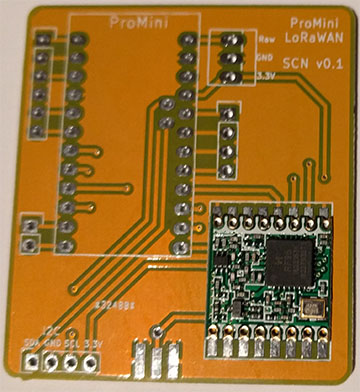
Solder it to the PCB. The easiest way to do this is to solder one corner (make sure to position the module correctly!), next solder the opposite corner to fix the module and finish by soldering the other contacts.

## Mounting the Arduino Pro Micro

First solder the two 12 pin headers to the Arduino Micro Pro module. Use the short metal side of the connector for the Arduino. Next plug the Arduino Pro Micro with connectors into the 'ProMini' footprint. 

NOTE: We will not be using the two pin connector inside the right (as shown on the pictures) connector, this is for Arduino Pro Mini only to bring out the I2C pins. The I2C pins for the Arduino Pro Micro are available on D2 (SDA) and pin D3 (SCL). If you want to use the I2C connector at the edge of the PCB you can connect a wire (on the reverse side of the PCB from D2 and D3 to the two holes, make sure to cross the wires so wire D2 which is the top pin to the bottom hole and vice versa.) Keep in mind any connector at that location will adversely affect a wire/coil antenna mounted next to it!

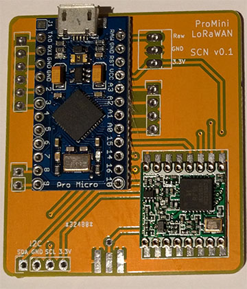

## Mount the antenna

Included in the kit is a coil antenna. This antenna will work for short distances. There are two options for better antenna

1. Mount a SMA connector and use it to mount a 'stick' antenna.
1. Use a wire antenna.

### Option 1: SMA

Mounting the SMA antenna using a SMA edge connector should not pose any challenges, slide it onto the three strips next to the RFM95 module with the center pin on top of the PCB. Keep in mind the SMA connector will get **very** hot when soldering it!

### Option 2: Wire antenna

A wire antenna is lowest cost solution which works surprisingly well. To create one, cut a piece of wire at about 10cm. Now strip about 5mm, tin it (for stranded wire) and solder it to the PCB using the hole next to the three strips at the PCB edge next to the RFM95 module.
Now trim the wire above the PCB to 82.2mm.

## The Finished Node

The picture below shows the finished node.


Additional headers can be mounted at the remaining footprints as required. See the note at 'Mounting the Arduino Pro Micro' concerning the I2C header.

# Software: Getting started

Start by downloading and installing the [Arduino IDE](https://www.arduino.cc/en/Main/Software). Once installed, start the IDE.

## Adding the Arduino Pro Micro

The Pro Micro boards have not been developed by Arduino. As a result the boards are not available in a newly installed IDE. To add the boards to the IDE open 'Preferences' from the 'File' menu.
In the 'Additional Boards Manager URL' enter 'https://raw.githubusercontent.com/sparkfun/Arduino_Boards/master/IDE_Board_Manager/package_sparkfun_index.json', Close the dialog with 'OK'.
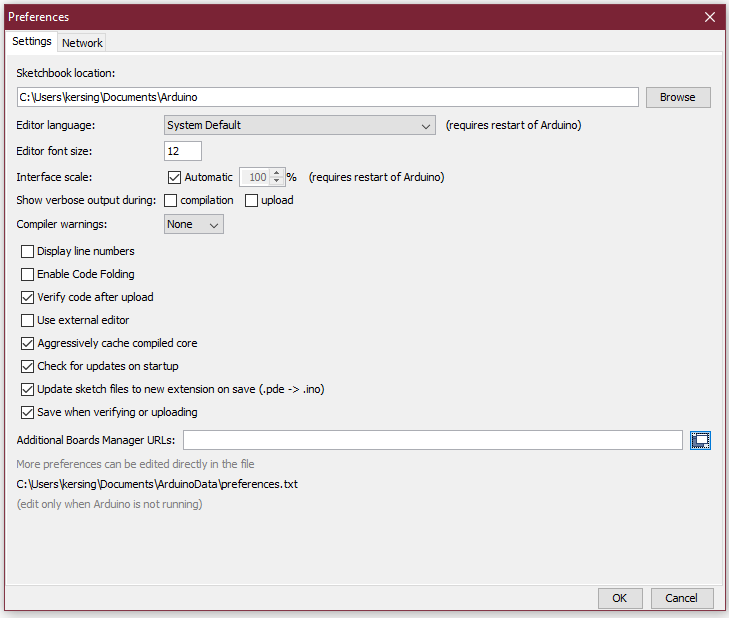

Now go to the 'Tools' menu, item 'Board: "Arduino/Genuino Uno"', this will open a sub menu, select 'Board Manager' from this new menu.
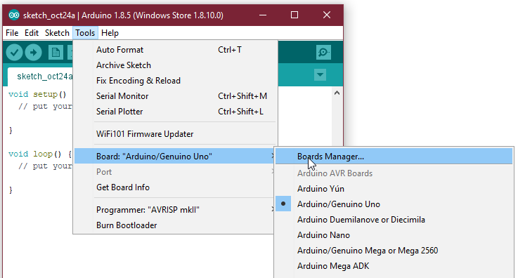

In the boards manager, type 'sparkfun' in the dialog to show all SparkFun provided board packages. Click on 'SparkFun AVR Boards' to select the package and click 'Install' to install the board definitions on your system.
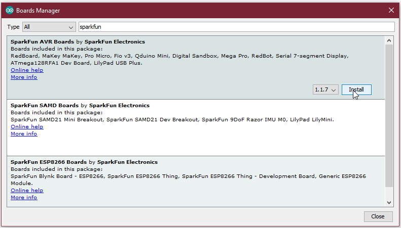

## Selecting the correct board

Open the 'Tools' menu and go to the 'Board: "Arduino/Genuino Uno"' again. Now select 'SparkFun Pro Micro' from the list.
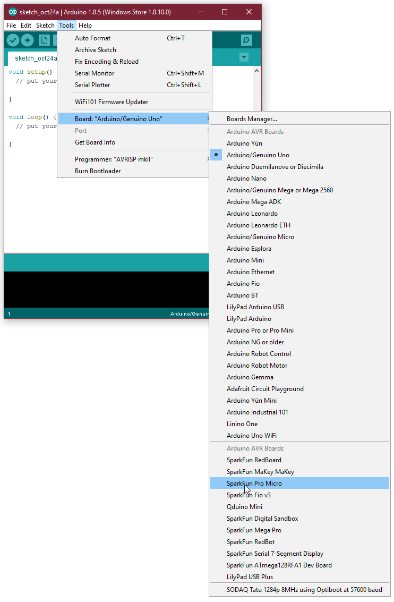

**NOTE:** the next step is **very** important. Not selecting the correct processor will disable the USB boot loader making it impossible to update the code after the first upload.
Open the 'Tools' menu again, at 'Processor' select "ATmega32u4 (3.3V, 8MHz)."

**NOTE: MAKE SURE you have selected the correct board!!**

## Get the LMIC library

The RFM95 is a 'plain' LoRa module. To make the module talk to The Things Network we need to implement the LoRaWAN layer in our code. Luckily we do not need to write the LoRaWAN stack from scratch, there are a number of implementations available on the Internet, LMIC being one of them.
If you search GitHub (or Google) for LMIC you will find numerous versions of the code. The one we will be using is maintained by Matthijs Kooijman.

1. Goto [https://github.com/matthijskooijman/arduino-lmic](https://github.com/matthijskooijman/arduino-lmic)
1. Choose 'Clone or download'
1. Download ZIP (remember the location you save the file)
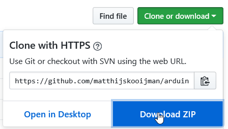

1. In the Arduino IDE select 'Sketch', 'Include Library' and select 'Add .ZIP library' in the sub menu.
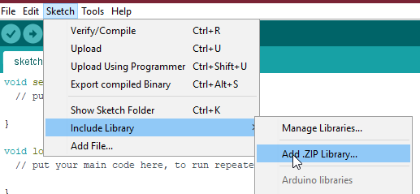

1. Browse to the file you just downloaded and open it
1. The green status bar at the bottom of the Arduino IDE should show a message indicating success.


## Get the low power library

1. Goto [https://github.com/rocketscream/Low-Power](https://github.com/rocketscream/Low-Power)
1. Choose 'Clone or download'
1. Download ZIP (again, remember the location you save the file)
1. In the Arduino IDE select 'Sketch', 'Include Library' and select 'Add .ZIP library' in the sub menu.
1. Browse to the file you just downloaded and open it

# Create a TTN account

If you do not yet have a TTN account (not a forum account) this is the time to create one. Surf to [https://account.thethingsnetwork.org/users/login](https://account.thethingsnetwork.org/users/login) and click on Create an account
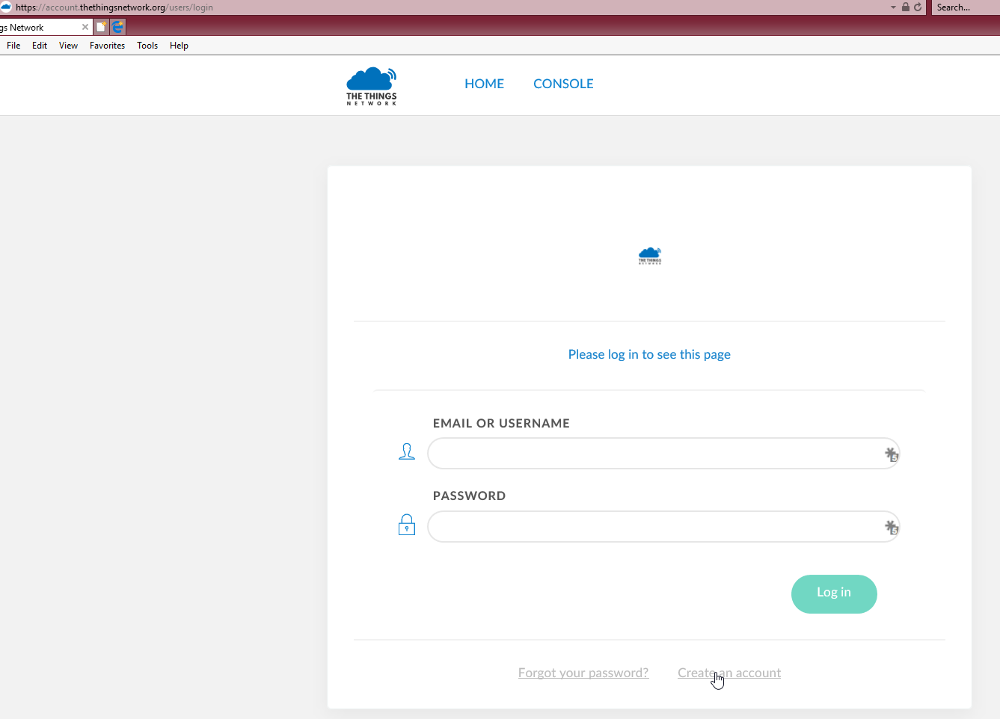

Enter valid information in the form, **read** the "Term and Conditions" and "Privacy Policy" and if you agree with the policies, "Create account".

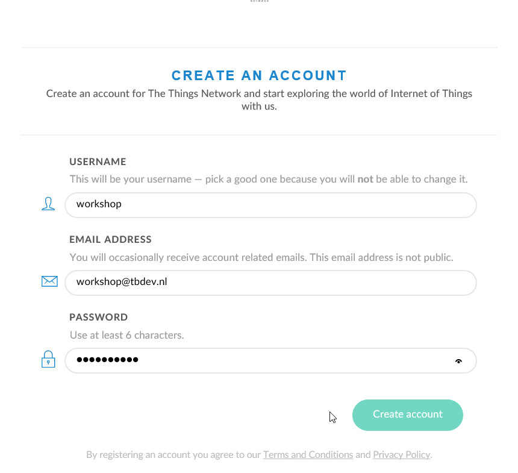

On the next page you will see a message regarding email validation. You will be able to use the account during the workshop, however it will expire at the time and date mentioned if not confirmed before that moment.

# The Console

The Things Network Console is where you register you nodes and (if you happen to own any) your gateways. Once you logged into the account server the console can be reached with a link at the top of the page.


On the console main page choose "Applications" because for TTN nodes are assigned to applications.

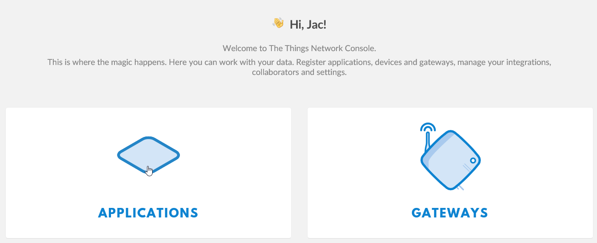

## Creating an application

Because nodes are part of an application the first thing to do is to create an application. On the application page click on "add application".

On the "add application" screen you will need to enter a number of values:

- Application ID : this needs to be a globally unique application identifier which can be seen by other users of the network. Do not use 'sensitive' information as it is not a secret!
- Description : any description that allows you to recognize the application.
- Application EUI : leave empty, the value will be generated.
- Handler registration : use 'ttn-handler-eu'.

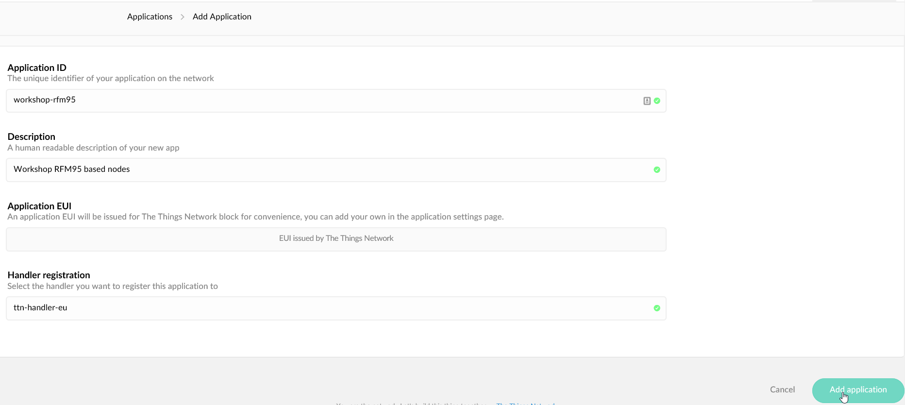
Click on the "Add Application" button to create the application.

If you enter an application ID that is already in use an error will appear when you try to add it.
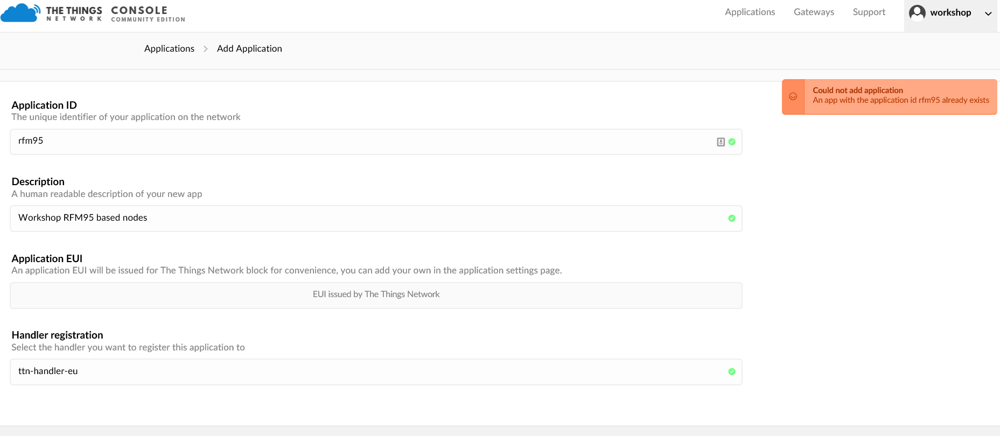

In that case choose a different ID and try again.

## Adding a node

Now we have the application we can register our node. On the application page scroll down to "DEVICES" and click on "register device" on the right hand side.


On the newly opened form enter the required information:

- Device ID : unique identifier to allow you to easily recognize the device.
- Device EUI : click on the interlinked arrows at the start of the field to change it to a pencil, now a unique EUI will be generated for us.
- App Key : leave blank, this will be generated as well.

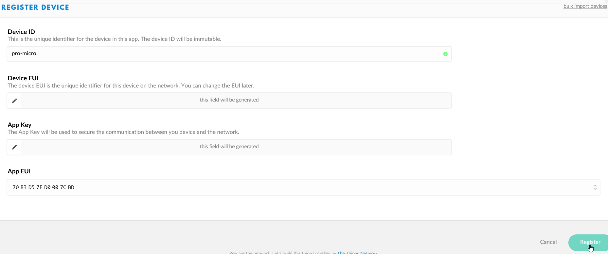

Keep this page open, we will need some of the information during the next steps.

# Creating the Arduino sketch

Everything is now in place to start coding our first Arduino sketch to connect our hardware to TTN.

Download the sample sketch from [http](url will follow) or cut-and-paste the code below:
```
/*******************************************************************************
 * Copyright (c) 2015 Thomas Telkamp and Matthijs Kooijman
 *
 * Permission is hereby granted, free of charge, to anyone
 * obtaining a copy of this document and accompanying files,
 * to do whatever they want with them without any restriction,
 * including, but not limited to, copying, modification and redistribution.
 * NO WARRANTY OF ANY KIND IS PROVIDED.
 *
 * This example will send Temperature and Humidity
 * using frequency and encryption settings matching those of
 * the The Things Network. Application will 'sleep' 7x8 seconds (56 seconds)
 *
 * This uses OTAA (Over-the-air activation), where where a DevEUI and
 * application key is configured, which are used in an over-the-air
 * activation procedure where a DevAddr and session keys are
 * assigned/generated for use with all further communication.
 *
 * Note: LoRaWAN per sub-band duty-cycle limitation is enforced (1% in
 * g1, 0.1% in g2), but not the TTN fair usage policy (which is probably
 * violated by this sketch when left running for longer)!

 * To use this sketch, first register your application and device with
 * the things network, to set or generate an AppEUI, DevEUI and AppKey.
 * Multiple devices can use the same AppEUI, but each device has its own
 * DevEUI and AppKey.
 *
 * Do not forget to define the radio type correctly in config.h.
 *
 *******************************************************************************/

#include <avr/sleep.h>
#include <avr/wdt.h>
#include <lmic.h>
#include <hal/hal.h>
#include <SPI.h>
#include "LowPower.h"

#include <Arduino.h>

int sleepcycles = 7;  // every sleepcycle will last 8 secs, total sleeptime will be sleepcycles * 8 sec
bool joined = false;
bool sleeping = false;
#define LedPin 22     // pin 13 LED is not used, because it is connected to the SPI port

// This EUI must be in little-endian format, so least-significant-byte
// first. When copying an EUI from ttnctl output, this means to reverse
// the bytes. For TTN issued EUIs the last bytes should be 0xD5, 0xB3,
// 0x70.

static const u1_t DEVEUI[8]  = { 0x00, 0x00, 0x00, 0x00, 0x00, 0x00, 0x00, 0x00 };
static const u1_t APPEUI[8] = { 0x00, 0x00, 0x00, 0x00, 0x00, 0x00, 0x00, 0x00 };

// This key should be in big endian format (or, since it is not really a
// number but a block of memory, endianness does not really apply). In
// practice, a key taken from ttnctl can be copied as-is.
// The key shown here is the semtech default key.
static const u1_t APPKEY[16] = { 0x00, 0x00, 0x00, 0x00, 0x00, 0x00, 0x00, 0x00, 0x00, 0x00, 0x00, 0x00, 0x00, 0x00, 0x00, 0x00 };

static void initfunc (osjob_t*);

// provide APPEUI (8 bytes, LSBF)
void os_getArtEui (u1_t* buf) {
  memcpy(buf, APPEUI, 8);
}

// provide DEVEUI (8 bytes, LSBF)
void os_getDevEui (u1_t* buf) {
  memcpy(buf, DEVEUI, 8);
}

// provide APPKEY key (16 bytes)
void os_getDevKey (u1_t* buf) {
  memcpy(buf, APPKEY, 16);
}

static osjob_t sendjob;
static osjob_t initjob;

// Pin mapping is hardware specific.
// Pin mapping
const lmic_pinmap lmic_pins = {
    .nss = 10, //8,
    .rxtx = LMIC_UNUSED_PIN,
    .rst = 0, //9,
    .dio = {4, 5, 7},//{2,5, LMIC_UNUSED_PIN}, //DIO0 and DIO1 connected
};


void onEvent (ev_t ev) {
  int i,j;
  switch (ev) {
    case EV_SCAN_TIMEOUT:
      Serial.println(F("EV_SCAN_TIMEOUT"));
      break;
    case EV_BEACON_FOUND:
      Serial.println(F("EV_BEACON_FOUND"));
      break;
    case EV_BEACON_MISSED:
      Serial.println(F("EV_BEACON_MISSED"));
      break;
    case EV_BEACON_TRACKED:
      Serial.println(F("EV_BEACON_TRACKED"));
      break;
    case EV_JOINING:
      Serial.println(F("EV_JOINING"));
      break;
    case EV_JOINED:
      Serial.println(F("EV_JOINED"));
      // Disable link check validation (automatically enabled
      // during join, but not supported by TTN at this time).
      LMIC_setLinkCheckMode(0);
      digitalWrite(LedPin,LOW);
      // after Joining a job with the values will be sent.
      joined = true;
      break;
    case EV_RFU1:
      Serial.println(F("EV_RFU1"));
      break;
    case EV_JOIN_FAILED:
      Serial.println(F("EV_JOIN_FAILED"));
      break;
    case EV_REJOIN_FAILED:
      Serial.println(F("EV_REJOIN_FAILED"));
      // Re-init
      os_setCallback(&initjob, initfunc);
      break;
    case EV_TXCOMPLETE:
      sleeping = true;
        if (LMIC.dataLen) {
        // data received in rx slot after tx
        // if any data received, a LED will blink
        // this number of times, with a maximum of 10
        Serial.print(F("Data Received: "));
        Serial.println(LMIC.frame[LMIC.dataBeg],HEX);
        i=(LMIC.frame[LMIC.dataBeg]);
        // i (0..255) can be used as data for any other application
        // like controlling a relay, showing a display message etc.
        if (i>10){
          i=10;     // maximum number of BLINKs
        }
          for(j=0;j<i;j++)
          {
            digitalWrite(LedPin,HIGH);
            delay(200);
            digitalWrite(LedPin,LOW);
            delay(400);
          }
      }
      Serial.println(F("EV_TXCOMPLETE (includes waiting for RX windows)"));
      delay(50);  // delay to complete Serial Output before Sleeping

      // Schedule next transmission
      // next transmission will take place after next wake-up cycle in main loop
      break;
    case EV_LOST_TSYNC:
      Serial.println(F("EV_LOST_TSYNC"));
      break;
    case EV_RESET:
      Serial.println(F("EV_RESET"));
      break;
    case EV_RXCOMPLETE:
      // data received in ping slot
      Serial.println(F("EV_RXCOMPLETE"));
      break;
    case EV_LINK_DEAD:
      Serial.println(F("EV_LINK_DEAD"));
      break;
    case EV_LINK_ALIVE:
      Serial.println(F("EV_LINK_ALIVE"));
      break;
    default:
      Serial.println(F("Unknown event"));
      break;
  }
}

void do_send(osjob_t* j) {
  byte buffer[22];
  // It is a bad idea to send ASCII for real, only use this when developing!!
  buffer[0]='H';
  buffer[1]='i';
  if (LMIC.opmode & OP_TXRXPEND) {
    Serial.println(F("OP_TXRXPEND, not sending"));
  } else {
    // Prepare upstream data transmission at the next possible time.
    LMIC_setTxData2(1, (uint8_t*) buffer, 2 , 0);
    Serial.println(F("Sending: "));
  }
}

// initial job
static void initfunc (osjob_t* j) {
    // reset MAC state
    LMIC_reset();
    LMIC_setClockError(MAX_CLOCK_ERROR * 1 / 100);
    // start joining
    LMIC_startJoining();
    // init done - onEvent() callback will be invoked...
}

void setup()
  {

  delay(10000);
  Serial.begin(9600);
  Serial.println(F("Starting"));
  delay(10000);
  os_init();
  // Reset the MAC state. Session and pending data transfers will be discarded.
  os_setCallback(&initjob, initfunc);
  LMIC_reset();
}


void loop()
{
    // start OTAA JOIN
    if (joined==false)
    {

      os_runloop_once();

    }
    else
    {
      do_send(&sendjob);    // Sent sensor values
      while(sleeping == false)
      {
        os_runloop_once();
      }
      sleeping = false;
      for (int i=0;i<sleepcycles;i++)
      {
          LowPower.powerDown(SLEEP_8S, ADC_OFF, BOD_OFF);    //sleep 8 seconds
      }
    }

      digitalWrite(LedPin,((millis()/100) % 2) && (joined==false)); // only blinking when joining and not sleeping

}
```

To 'tune' this example to your TTN application you need to change:

- DEVEUI
- APPEUI
- APPKEY

Go back to the browser and open the console page for the device you created earlier. This page will list the three items listed above. Between the label and the value is are two icons. One with '<>' and one with two arrows. For all three values press the '<>' icon to show the values C-style (with '{' and 0x), for DEVEUI and APPEUI hit the arrow icon once to change to LSB setting.

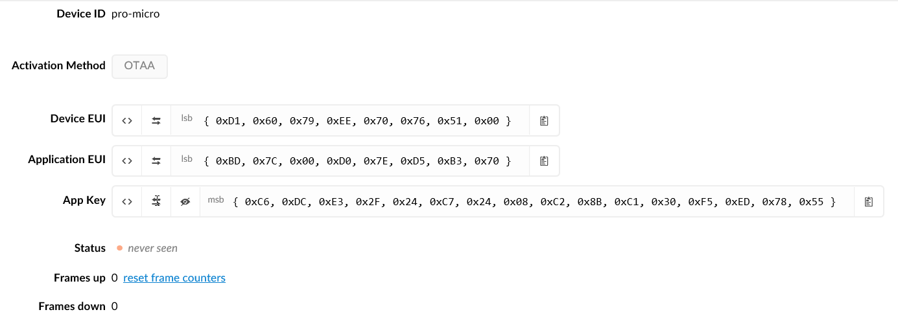

Now copy the three values to your sketch. Use the 'notepad' icon at the end of the value to copy the value to the clipboard.

Save the result and compile the sketch by hitting the check mark icon below 'File'. If no error are shown connect your node to your system using an USB mini cable. A red LED should light indicating the module is powered.

Wait a few seconds for the system to install the appropriate USB drivers. Next go to 'Tool', 'Port' in the Arduino IDE and select the port your Pro Micro is connected to.
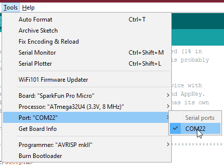

**NOTE:** At this point you should double check the Board and Processor settings are (still) correct. Board should be 'SparkFun Pro Micro' and processor 'ATmega32U4 (3.3V, 8MHz)'. Correct the values if required!

Now send the sketch to the board using the arrow icon below 'Edit'. Once the upload is finished open the 'Serial monitor' from the 'Tools' menu. After a few seconds output should start to appear in the monitor.


## Check the console for output

In the web browser with the TTN console switch to the 'Data' tab. Data should start to appear on this page once the node is up and running.


# Low power operation

To reduce the amount of power used by the node you want to disable all LEDs as these use a relatively large amount of power. This means disabling/removing the power led on the Pro Mini module. Only attempt this if you are very comfortable with removal of SMD parts as it might damage the module beyond repair.